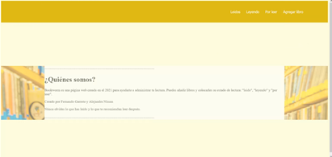
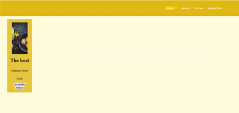
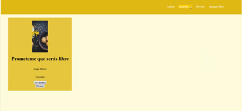
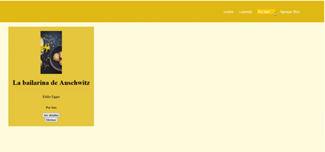
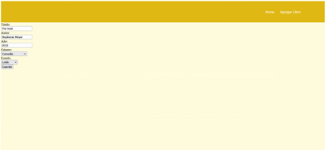
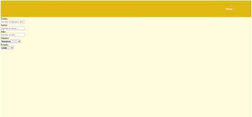

# ProyectoFinalWeb
## Creadores
### Fernando Garrote A01027503
### Alejandra Nissan A01024682

# Table of Contents
1. [Instrucciones De Ejecución del Código](#Instrucciones)
2. [Descripción del Proyecto](#Descripcion)
3. [Arquitectura de Solución](Arquitectura)
4. [Acciones que se pueden realizar](#Acciones)
5. [Capturas de la página web](#Capturas)

## Instrucciones De Ejecución del Código 
## Descripción del Proyecto 
Bookworm es una página web creada en el 2021 para ayudarte a administrar tu lectura. Puedes añadir libros y colocarles su estado de lectura: "leido", "leyendo" y "por leer". 
Núnca olvides lo que has leído y lo que te recomiendan leer después.
## Arquitectura de Solución 
## Acciones que se pueden realizar 
El proyecto es una página web en la que se pueden agregar los libros que el usuario está leyendo, los que ya leyó y los que va a leer. El usuario puede añadir, editar y borrar los libros y cambiarles el estado. Cuando el usuario abre la página lo primero que aparece es la pantalla de home en donde sale una pequeña descripción de la página web. En la parte de arriba a la derecha salen los botones: “Leídos”, “Leyendo”, “Por leer” y “Agregar libro”. Si el usuario oprime uno de los 4 botones se va a la vista correspondiente. En las vistas de  “Leídos”, “Leyendo” y “Por leer” salen los libros correspondientes y cada libro tiene dos botones los cuales son: “Ver detalles” y “Eliminar”. El botón de “Ver detalles” manda al usuario a otra pantalla en donde le sale todos los datos del libro, esos datos los puede modificar y al final sale un botón para guardar lo que se modificó. Si el usuario pone un título, autor o fecha no válidos entonces no se puede oprimir el botón de guardar. El botón “Eliminar” sirve para borrar el libro de la base de datos. Por último la pantalla de “Agregar libro” sirve para agregar nuevos libros y en esa pantalla se debe de agregar el título, autor, fecha, género y estado del libro, después de agregar todo lo correspondiente el usuario debe de guardar lo que agregó.

## Capturas de la página web 

